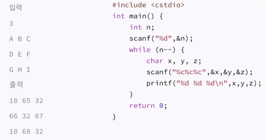
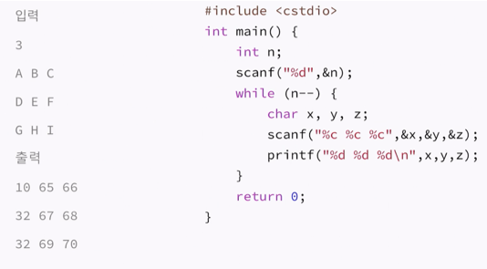
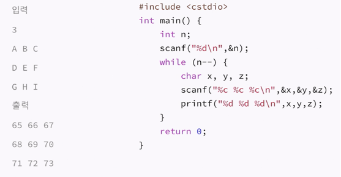
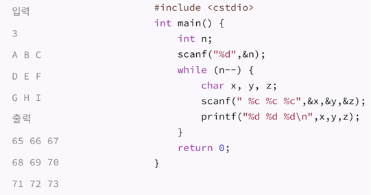

# 프로그램 대회에서 사용하는 C, C++, STL

## C

### printf, scanf

포맷 문자열을 이용해서 입출력을 받는 함수.

#### 포맷 문자열

- %d: 정수
- %x: 16진수 정수
- %o: 8진수 정수
- %f: float
- %lf: double
- %Lf: long double
- %lld: long long
- %c: 문자
- %s: 문자열
- %i: 정수 (형태에 따라 다르게 입력 받음)

#### %i

입력하는 수의 형태에 따라 다르게 입력 받음.

- 10진수: 일반 정수 (10 -> 10)
- 8진수: 앞에 0이 붙어있는 정수 (010 -> 8)
- 16진수: 앞에 0x이 붙어있는 정수 (0x10 -> 16)

[연습문제](https://www.acmicpc.net/problem/11816)

```c
#include <stdio.h>

int main() {
    int x;
    scanf("%i", &x);
    printf("%d", x);
    return 0;
}
```

#### scanf

**scanf의 리턴값**

- scanf의 리턴값은 성공적으로 입력받은 인자의 개수.
- 파일의 끝까지 입력받아야 하는 경우에는 `while(scanf("%d %d", &a, &b) == 2)`처럼 사용할 수 있음. (테스트 케이스가 주어지지 않아 파일의 끝이나 EOF까지 입력을 받아야하는 경우 사용할 수 있음)

[연습문제](https://www.acmicpc.net/problem/10951)

```c
#include <stdio.h>

int main() {
    int a, b;
    while(scanf("%d %d", &a, &b) == 2) {
        printf("%d\n", a+b);
    }
    return 0;
}
```

**공백과 줄바꿈은 무시하는 scanf**

```
10 20 30
```
을 입력하는 것과

```
10
             20
     30
```
입력하는 것은 같음.

**%c**

%c는 생각처럼 동작하지 않을 때가 많은데 공백과 줄바꿈 모두 문자여서 문자로 인식하기 때문임.



A = 65 / 공백 = 32 / 줄바꿈 = 10

위와 같은 경우 공백과 줄바꿈을 문자로 받아서 엉뚱한 출력값이 나옴.



위와 같은 경우는 공백은 처리가 되었지만 줄바꿈이 처리되지 않음.



테스트 케이스를 입력받을 때부터 줄바꿈을 처리해줘야함.



가장 많이 쓰는 방법으로 위와 같이 %c 앞에 공백을 주어 줄바꿈과 공백을 무시하고 입력을 받음.

**%[]**

%[123]: 대괄호 안에 입력한 문자(1,2,3)만 입력받음.

ex) 

```c
scanf("%[123]", a);	// 123232131456을 입력하면 a에 123232131만 들어감
```

%[^123]: 대괄호 안에 입력한 문자(1,2,3)을 제외하고 입력받음.

ex) 

```c
scanf("%[^123]", a);	// 9860832을 입력하면 a에 98608만 들어감
```

**응용: 그대로 출력하기**

[연습문제](https://www.acmicpc.net/problem/11718)

`scanf("%[^\n]\n", s);`

- 줄바꿈을 입력받지 않기 때문에 편리한 방법이지만, 각 줄의 앞 뒤에 있는 공백은 무시하므로 빈 줄을 입력받을 수 없음.
- 공백으로 시작하는 경우에 공백을 무시하므로 문자부터 입력받음.

```c
#include <stdio.h>

int main() {
    char s[101];
    while(scanf("%[^\n]\n", s) == 1) {
        printf("%s\n", s);
    }
    return 0;
}
```
 
xcode에서 컴파일한 경우에 한 줄씩 밀려서 출력되는 문제가 있었으나 백준 홈페이지에서는 정답처리됨.

[연습문제2](https://www.acmicpc.net/problem/11719): 공백과 빈 줄이 있는 입력

이럴 경우 어쩔 수 없이 한 글자씩 입력받는 getchar()와 한 줄을 통째로 입력받는fgets() 함수 이용.

```c
#include <stdio.h>

int main() {
    char c;
    while((c = getchar()) && c != EOF) {
        printf("%c", c);
    }
    return 0;
}
```

**%1d**

- %와 d 사이에 넣은 수의 길이 만큼 끊어서 입력을 받음.
- 입력으로 인접행렬이 주어지는 경우에 많이 사용.

[연습문제](https://www.acmicpc.net/problem/11720)

```c
#include <stdio.h>

int main() {
    int c;
    scanf("%d", &c);
    int result = 0;
    while(c--) {
        int a;
        scanf("%1d", &a);
        result += a;
    }
    printf("%d", result);
    return 0;
}
```

**%10s**

[연습문제](https://www.acmicpc.net/problem/11721)

- %와 s 사이에 넣은 수의 길이 만큼 끊어서 입력을 받음.
- 입력받을 수 있는 것의 개수가 지정한 개수보다 적으면 그만큼만 입력받음.

```c
#include <stdio.h>

int main() {
    char s[101];
    while( scanf("%10s", s) == 1) {
        printf("%s\n", s);
    }
    return 0;
}
```

**%*d**

변수에 저장하지 않음

```c
#include <stdio.h>
int main() {
	int x,y;
	scanf("%d %*d %d", &x, &y); // 10 20 30 입력
	printf("%d %d\n", x, y); // 10 30 출력함
	return 0;
}
```

## C++

### cin, cout

scanf와 printf와 같은 입출력 함수. 차이점은 데이터 타입을 포맷 문자열을 통해 명시해 줄 필요 없음. 

scanf와 printf 보다 느림. main 함수에서 cin과 cout을 사용하기 전에 `ios_base::sync_with_stdio(flase);`을 쓰면 빨라지나 printf, scanf와 cin, cout을 섞어 쓸 수 없게됨.

### getline

```c++
string s;
getline(cin, s);
```

한 줄 전체 다를 입력받기 위해 사용하는 함수.

### setprecision

유효숫자 자리수를 지정할 수 있음.

```c++
#include <iomanip>
#include <iostream>
using namespace std;
int main() {
	double f = 3.14159265358979;
	cout << setprecision(5) << f << '\n'; 	// 3.1415
	cout << setprecision(8) << f << '\n';	// 3.1415927
	cout << setprecision(10) << f << '\n';	// 3.141592654
	return 0;
}
```

setprecision(5)이면 6자리에서 반올림을 하는데 보통 문제에서는 소수점 몇째자리까지 출력 혹은 정답과의 오차가 10^-4까지 허용한다라는 식임. 

유효숫자가아닌 소수점 몇째자리까지 출력할 건지 결정하는 것이 필요함.

```c++
#include <iomanip>
#include <iostream>
using namespace std;
int main() {
	double f = 3.14159265358979;
	cout << fixed << setprecision(5) << f << '\n'; 	// 3.14159
	cout << fixed << setprecision(8) << f << '\n';	// 3.14159265
	cout << fixed << setprecision(10) << f << '\n';	// 3.1415926536
	return 0;
}
```

### endl vs '\n'

줄바꿈 시에 endl은 줄바꿈을 출력하고 스트림을 flush 시키는 기능도 포함되어 있어  '\n' 보다 느림.

[연습문제](https://www.acmicpc.net/problem/2741)

```c++
#include <iostream>
using namespace std;
int main() {
    int n;
    cin >> n;
    for(int i=1; i<=n; i++) cout << i << '\n';
    return 0;
}
```

cout보다는 printf가 더 빠름.

## C++11

### auto

- 컴파일러가 타입을 추론해서 타입을 결정함. 
- 선언시 변수의 타입을 명확하게 알 수 있어야 함. 
- 중간에 타입을 바꿀 수 없음.

컴파일 에러가 나는 코드

```c++
auto a,b; // 선언시 명확한 타입을 알 수 없음
cin >> a >> b;
cout << a + b << '\n";
```

올바른 코드

```c++
auto a = 0,b =0 ;
cin >> a >> b;
cout << a + b << '\n";
```

iterator 사용 시 편리함

```c++
// auto를 사용하지 않는 경우
map<pair<int, int>, vector<pair<int, string>>> d;
for(map<pair<int, int>, vector<pair<int, string>>>::iterator it = d.begin(); it != d.end(); it++) { ... }
// 위와 같은 코드를 아래처럼 줄일 수 있음
map<pair<int, int>, vector<pair<int, string>>> d;
for(auto it = d.begin(); it != d.end(); it++) { ... }
```

### Range-based for

다른 언어의 for each문에 해당하는 문법.

```c++
vector<int> a = {1, 2, 3, 4, 5};
for(int i=0; i<a.size(); i++) {
	cout << a[i] << ' ';
}
cout << '\n';

for(int x : a) {
	cout << x << ' ';
}
cout << '\n';
```

& 연산자를 사용하여 값 복사가 아닌 참조로 동작하는 방법. vector가 엄청 큰 경우 for를 돌리는 것보다 값 복사하는 시간이 포함되어 느려짐.

```c++
vector<pair<int, int>> a = {{1, 2}, {3, 4}, {5, 6}};
for(int i=0; i<a.size(); i++) {
	cout << a[i].first + a[i].second << ' ';
}
cout << '\n';

for(auto &p : a) {
	cout << p.first + p.second << ' ';
}
cout << '\n';
```

초기화 리스트를 이용하는 경우.

```c++
int sum = 0;
for(auto x : {1, 2, 3, 4}) {
	sum += x;
}
cout << "sum = " << sum << '\n';
```

배열을 이용하는 경우.

```c++
int a[] = {1, 2, 3, 4, 5};
sum = 0;
for (auto x : a) {
	sum += x;
}
cout << "sum = " << sum << '\n';
```

문자열을 출력하는 경우.

```c++
const char cstr[] = "string";
sum = 0;
for(auto x : cstr) {
	sum += 1;
}
cout << "sum = " << sum << '\n';	// 배열 마지막에 있는 널 문자 때문에 7출력

string str = "string";
sum = 0;
for(auto x : str) {
	sum += 1;
}
cout << "sum = " << sum << '\n';	// 6출력
```

### 초기화 리스트

```c++
vector<int> a;
a.push_back(1);
a.push_back(3);
a.push_back(5);

vector<int> a = {1, 3, 5};	// 배열처럼 초기화하면서 선언 가능
```

위처럼 선언하는 것은 STL 컨테이너에서만 적용되는게 아니라 직접 만든 구조체에도 순서만 맞으면 가능함. 추가로 여러가지 인터페이스에서도 가능.

```c++
struct Person {
	string name;
	int age;
}

set<int> s = {1, 2, 3, 4, 5};
map<int, string> m = { {20, "a"}, {10, "hi"} };
Person p = {"you", 20};
map<int, vector<pair<int, int>>> m2 = {
	{10, {{1, 2}, {3, 4}}},
	{20, {{5, 6}, {7, 8}, {9, 10}}}
};
```

### 람다 함수

구성: [캡쳐](함수 인자) {함수 내용}

```c++
int sum(int x, int y) {
	return x+y;
}
cout << sum(1, 2) << '\n';

cout << [](int x, int y) {
	return x+y;
}(1, 2) << '\n';
```

람다 함수도 변수로 만들 수 있음.

```c++
auto sum2 = [](int x, int y) {
	return x+y;
};
cout << sum2(1, 2) << '\n';
```

[연습문제](https://www.acmicpc.net/problem/2555)

```c++
#include <iostream>
using namespace std;
int main() {
    auto print = [] {
        cout << "10/14" << '\n';
    };
    print();
    return 0;
}
```

**캡쳐**

람다 함수의 스코프를 결정함.

[연습문제](https://www.acmicpc.net/problem/10871)

```c++
int n, y;
cin >> n >> x;
auto is_less = [&] (int number) {
// 함수 밖에 선언되어 있는 변수를 사용하고 싶을 때 캡쳐에 &를 넣어줌
	return number < x; 
};
```

```c++
#include <iostream>
using namespace std;
int main() {
    int n, x;
    cin >> n >> x;
    auto is_less = [&](int n) {
        return n < x;
    };
    for(int i=0; i<n; i++) {
        int a;
        cin >> a;
        if(is_less(a)) {
            cout << a << ' ';
        }
    }
    return 0;
}
```

- 캡쳐에 &을 넣으면 선언하는 시점에서 바깥에 있는 변수를 모두 사용가능.
- &x와 같이 어떤 변수를 사용할 것인지도 적을 수 있음.
- &는 참조고, =는 값 복사임.
- 여러 개는 ,를 이용할 수 있음.

```c++
int x = 10;
int y = 20;

auto f = [&x, y]() {
	x += 10;
	// y += 10;	// 주석 해제시 컴파일 에러. auto f = [&x, y]() mutable { 로 선언하면 컴파일은 되지만 실행 결과는 동일함.
};

cout << "x = " << x << ", y = " << y << '\n'' // x = 10, y = 20 출력
f();
cout << "x = " << x << ", y = " << y << '\n'' // x = 20, y = 20 출력
f();
cout << "x = " << x << ", y = " << y << '\n'' // x = 30, y = 20 출력
```

**변수 타입**

함수의 변수 타입은 #include <functional>에 선언되어 있음. function<리턴타입(콤마로 구분한 인자의 타입들)>을 적어주면 됨.

```c++
function<void()> print = [] {};
function<void(int)> print2 = [] (int x) {};
function<int(int, int)> sum = [] (int x, int y) {
	return x+y;
};
```

[연습문제](https://www.acmicpc.net/problem/10807)

재귀함수 호출시에는 auto를 사용할 수 없음.

```c++
#include <iostream>
#include <functional>
using namespace std;
int main() {
    int n;
    cin >> n;

// f 함수가 함수 밖에 있으므로 캡쳐에 &를 넣어줘야 함
    function<int(int)> f = [&](int n) {
        if(n <= 1) return n;
        else return f(n-1) + f(n-2);
    };
    
    cout << f(n) << '\n';
    return 0;
}
```

[연습문제2](https://www.acmicpc.net/problem/10869)

```c++
vector<function<int(int, int)>> d;
d.push_back([](int x, int y) {
	return x+y;
});
d.push_back([](int x, int y) {
	return x-y;
});
d.push_back([](int x, int y) {
	return x*y;
});
d.push_back([](int x, int y) {
	return x/y;
});
d.push_back([](int x, int y) {
	return x%y;
});

for(auto &f : d) {
	cout << f(a, b) << '\n';
}
```