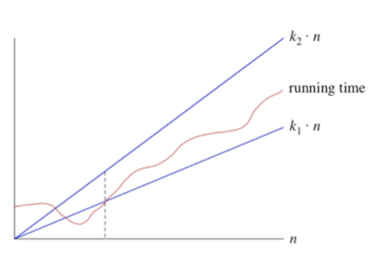
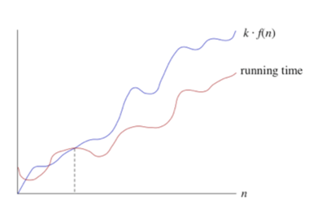
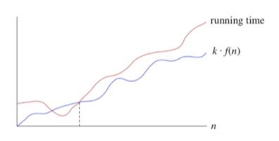
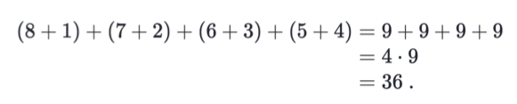
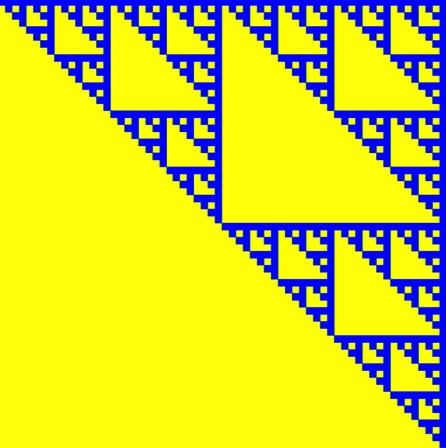
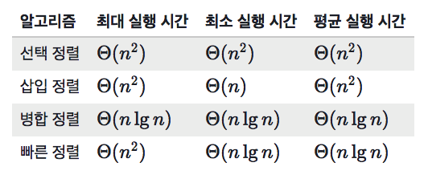

# 칸 아카데미 알고리즘 강좌 정리

[https://ko.khanacademy.org/computing/computer-science/algorithms](https://ko.khanacademy.org/computing/computer-science/algorithms)

## 숫자 맞추기

### 방법 1: 선형 검색(linear search)

- 차례대로 검색
- 확실하지만 추측 횟수가 너무 많음 
- 전체 개수가 n일 때, 최대 n 추측, 평균 추측 수 n/2

### 방법 2: 이진 검색(binary search)

- 후보 범위를 하나로 좁힐 때까지 찾고자 하는 항목을 포함하고 있는 리스트를 반으로 나누는 과정을 계속 반복함
- 순차적인 항목 리스트에서 원하는 항목을 찾기에 효율적임
- 가장 많이 사용하는 경우는 배열에서 어떤 항목을 찾을 때

## 길 찾기 문제

### 해결방법

1. 목표 네모에서 시작. 목표 지점에서 목표 지점까지는 0단계가 걸리므로 목표 지점에 숫자 0 표시
2. 미로에서 목표 지점에서 정확히 1단계 멀리있는 모든 네모를 찾아서 숫자 1이라고 표시
3. 목표 지점에서 정확히 2단계 떨어져 있는 모든 네모를 찾음. 이 네모들은 1로 표시했던 네모에서 1단계 떨어져 있고, 아직 표시되지 않은 네모임. 이 네모들을 숫자 2로 표시
4. 목표 지점에서 정확히 3단계 떨어져 있는 모든 네모를 찾음. 이 네모들은 2로 표시했던 네모에서 1단계 떨어져 있고, 아직 표시되지 않은 네모임. 이 네모들을 숫자 3로 표시
5. 이런 식으로 목표 지점에서 거리가 커지는 순서대로 미로 안의 네모들을 계속 표시. 숫자 k로 네모를 표시한 후 k로 표시된 네모들에서 한 단계 멀리 있고 아직 표시가 되어 있지 않은 모든 네모들을 숫자 k+1라고 표시함
6. 출발 지점에 네모를 표시하는 순간이 옴. 그러면 출발 지점에서 경로를 따라 네모의 숫자가 항상 줄어드는 방향으로 네모들을 선택하여 목표 지점으로의 경로를 찾아냄

## 이진 검색 

### 의사코드(pseudocode)

1.  min=0, max=n-1
2. guess=min와 max의 평균값(정수이므로 내림)
3. 만약 array[guess]가 target이라면 끝. return guess
4. 만약 array[guess]<target이면 min=guess+1
5. 만약 array[guess]>target이면 max=guess-1
6. 2번으로 돌아감

### array에 target이 없는 경우를 고려하는 의사코드

1. min=0, max=n-1
2. 만약 max<min이면 멈춤. target는 array에 존재하지 않는 것임. return -1
3. guess=min와 max의 평균값(정수이므로 내림)
4. 만약 array[guess]가 target이라면 끝. return guess
5. 만약 array[guess]<target이면 min=guess+1
6. 만약 array[guess]>target이면 max=guess-1
7. 2번으로 돌아감

### javascript 코드

```js
/* Returns either the index of the location in the array,
  or -1 if the array did not contain the targetValue */
var doSearch = function(array, targetValue) {
	var min = 0;
	var max = array.length - 1;
    var guess;
    var count = 0;
    
    while(min <= max) {
        count++;
		guess = Math.floor((min + max) / 2);
		println("guess is " + guess);
		if(array[guess] === targetValue) {
		    println("count is " + count);
			return guess;
		} else if(array[guess] < targetValue) {
			min = guess + 1;
		} else {
			max = guess - 1;
		}
	}

	return -1;
};

var primes = [2, 3, 5, 7, 11, 13, 17, 19, 23, 29, 31, 37, 
		41, 43, 47, 53, 59, 61, 67, 71, 73, 79, 83, 89, 97];

var result = doSearch(primes, 73);
println("Found prime at index " + result);

Program.assertEqual(doSearch(primes, 73), 20);
Program.assertEqual(doSearch(primes, 61), 17);
Program.assertEqual(doSearch(primes, 4), -1);
```

### 이진 검색 실행 횟수

길이가 n인 배열: n개의 값부터 시작해 1개만 남을떄까지 범위를 반으로 줄여나간 횟수에 1을 더한 횟수 
=> (2를 밑으로 하는 n의 로그) + 1

## 점근적 표기법(asymptotic notation)

### 알고리즘 실행 시간

1. 입력값의 크기에 따른 알고리즘의 실행 시간
2. 실행 시간의 성장률(rate of growth): 입력값의 크기에 따라 이 함수가 얼마나 빨리 커지는지

중요하지 않은 항목과 상수 계수를 제거하여 알고리즘 실행 시간에서 중요한 부분인 성장률에 집중할 수 있음

### Big-θ (빅 세타) 표기법

**Θ(n)**



- 실행시간을 표시하기 위해 사용하는 표기법
- 실행 시간이 커지는 것을 일정 하한선과 상한선 내에서 점근적으로 제한하기 위해 사용
- 특정 실행 시간이 Θ(n)이라고 하는 것은 n이 충분히 크다면 실행 시간이 어떤 상수 k1와 k2에 대하여 최소 k1\*n이며 최대 k2\*n가 된다는 뜻 (n의 작은 값에 대해서는 고려하지 않음)
- n값이 충분히 커지면 점선에서 오른쪽 실행 시간은 반드시 k1\*n와 최대 k2\*n 사이에 있음. k1와 k2라는 상수가 있다면 실행 시간은 Θ(n)이라 할 수 있음
- 시간 단위를 고려할 필요가 없음
- 실행 시간에 대해 점근적으로 근접한 한계값이 있다고 표현하는 것(위아래로 상수값 내에서 실행 시간을 좁힐 수 있다는 뜻)

### 점근적 표기법 형태의 함수

1. n0 = 1 일 때, Θ(n0)라고 안쓰고 Θ(1)이라 씀
2. Θ(log10-n) 시간은 Θ(lg-n) 시간이 걸린다고 할 수 있음
	- 로그의 밑이 상수라면 점근적 표기법에서 어떤 밑 값을 사용하는지 상관없음
	- loga-n = logb-n / logb-a 라는 공식 때문
3. a<b라면 Θ(n^a)의 실행 시간은 Θ(n^b)의 실행 시간보다 천천히 커짐
4. 알고리즘 분석 시 자주 쓰이는 점근적 표기법의 함수(커지는 속도가 느린 것부터 빠른 순서대로)
	1. Θ(1)
	2. Θ(lg-n)
	3. Θ(n)
	4. Θ(nlg-n)
	5. Θ(n^2)
	6. Θ(n^2lg-n)
	7. Θ(n^3)
	8. Θ(2^n)

### Big-O 표기법(점근적 상한선)

**O(n)**



- 실행 시간이 커지는 것을 일정 상한선 내에서만 점근적으로 제한하기 위해 사용
- 실행 시간은 최대한 이만큼 커지지만 더 천천히 커질 수도 있음을 의미
- 실행 시간이 O(f(n))이라면 충분히 큰 값인 n에 대해 실행 시간은 어떤 상수값 k에서 최대 k*f(n)가 됨

### Big-θ와 Big-O

- 어떤 경우에는 실행 시간이 Θ(f(n))이라고 말한다면 이는 또한 O(f(n))이기도 함. 역은 항상 참이 아님
- rate of growth가 더 큰 점근적 상한선이 올바르다고 말할 수는 있지만 덜 정확함. Big-θ는 올바른 표현이 될 수 없음

### Big-Ω 표기법(점근적 하한선)

**Ω(n)**



- 알고리즘이 상한선 없이 최소한 어느 정도 걸린다고 해야할 때 사용
- 실행 시간이 Ω(f(n))라면 n이 충분히 클 때 실행 시간은 어떤 상수 k에 대해 최소 k*f(n)임
- Θ(f(n))가 자동적으로 O(f(n))를 의미하는 것과 마찬가지로 Ω(f(n)도 의미함
- 정확하진 않지만 모든 실행 시간이 Ω(1)이라 말할 수 있음

## 정렬

### swap 함수

```js
var swap = function(array, firstIndex, secondIndex) {
    var temp = array[firstIndex];
	array[firstIndex] = array[secondIndex];
	array[secondIndex] = temp;
};

var testArray = [7, 9, 4];
swap(testArray, 0, 1);

println(testArray);

Program.assertEqual(testArray, [9, 7, 4]);
```

### 선택 정렬 의사코드

1. 가장 작은 카드를 찾아 첫 번째 카드와 바꿈
2. 두 번째로 작은 카드를 찾아 두 번째 카드와 바꿈
3. 세 번째로 작은 카드를 찾아 세 번째 카드와 바꿈
4. 배열이 정렬이 다 될때까지 계속 다음으로 작은 카드를 찾아서 정확한 위치로 옮김

### 하위 배열에서 최솟값 찾기

```js
var indexOfMinimum = function(array, startIndex) {
    var minValue = array[startIndex];
    var minIndex = startIndex;

    for(var i=minIndex+1; i<array.length; i++) {
     if(array[i] < minValue) {
         minValue = array[i];
         minIndex = i;
     }
    }
    
    return minIndex;
}; 

var array = [18, 6, 66, 44, 9, 22, 14];   
var index = indexOfMinimum(array, 2);

println("The index of the minimum value of the subarray starting at index 2 is " + index + "."  );
Program.assertEqual(index, 4);
```

## 선택 정렬 구현

```js
var swap = function(array, firstIndex, secondIndex) {
    var temp = array[firstIndex];
    array[firstIndex] = array[secondIndex];
    array[secondIndex] = temp;
};

var indexOfMinimum = function(array, startIndex) {

    var minValue = array[startIndex];
    var minIndex = startIndex;

    for(var i = minIndex + 1; i < array.length; i++) {
        if(array[i] < minValue) {
            minIndex = i;
            minValue = array[i];
        }
    } 
    return minIndex;
}; 

var selectionSort = function(array) {
    for(var i=0; i<array.length-1; i++) {
        var swapIndex = 0;
        swapIndex = indexOfMinimum(array, i);
    swap(array, i, swapIndex);
    }
};

var array = [22, 11, 99, 88, 9, 7, 42];
selectionSort(array);
println("Array after sorting:  " + array);

Program.assertEqual(array, [7, 9, 11, 22, 42, 88, 99]);
```

### 1부터 n까지 수의 합 계산 - 등차급수



1. 가장 작은 수와 가장 큰 수끼리 짝지어 더함
2. 짝지은 수의 개수만큼 곱해줌
3. 홀수 개수라면 홀로 남은 수는 한쌍의 반으로 취급하며 계산함

1. 수가 총 n개 만큼 있을 때 가장 작은 수와 가장 큰 수의 합은 n+1
2. n/2개의 쌍
3. 따라서 1부터 n까지 수의 합운 (n+1)(n/2)로 나타냄
4. 바꿔 쓰면 (n^2+n)/2

### 선택 정렬에 대한 점근적 실행 시간 

선택 정렬에 소요되는 총 실행 시간

1. 모든 indexOfMinimum 호출에 대한 실행 시간 - 루프가 n번 만큼 반복되며 그 다음부터는 n-1, n-2... 이렇게 줄어드는 등차급수며 (n^2+n)/2로 나타낼 수 있음: Θ(n^2)
2. 모든 swap 호출에 대한 실행 시간 - n번 만큼 호출되고 때마다 같은 시간 소요: Θ(n)
3. selectionSort 함수 내 남아있는 다른 모든 루프의 실행시간: Θ(n)

이 셋 중 Θ(n^2)이 가장 유효한 항이므로 선택 정렬의 실행시간은 Θ(n^2)으로 정의할 수 있음

## 삽입 정렬

### insert 구현

```js
var insert = function(array, rightIndex, value) {
  var index;
  for(index=rightIndex; index>=0 && array[index]>value; index--) {
    array[index+1] = array[index];   
  }
  array[index+1] = value;
};

var array = [3, 5, 7, 11, 13, 2, 9, 6];

insert(array, 4, 2);
println("Array after inserting 2:  " + array);
Program.assertEqual(array, [2, 3, 5, 7, 11, 13, 9, 6]);

insert(array, 5, 9);
println("Array after inserting 9:  " + array);
Program.assertEqual(array, [2, 3, 5, 7, 9, 11, 13, 6]);

insert(array, 6, 6);
println("Array after inserting 6:  " + array);
Program.assertEqual(array, [2, 3, 5, 6, 7, 9, 11, 13]);
```

+) for문의 조건에 index>=0를 뒤쪽에다 넣어서 한참 고생했음 ㅠㅠ

### 삽입 정렬 의사코드

1. insert를 호출하여 인덱스 0의 정렬된 하위 배열에 인덱스 1부터 시작하는 요소를 삽입
2. insert를 호출하여 인덱스 0에서 1까지 정렬된 하위 배열에 인덱스 2부터 시작하는 요소를 삽입
3. ...
4. 마지막으로 insert를 호출하여 인덱스 0에서 n-2까지 정렬된 하위 배열에 인덱스 n-1부터 시작하는 요소를 삽입

### 삽입 정렬 구현

```js
var insert = function(array, rightIndex, value) {
  var index;
  for(index=rightIndex; index>=0 && array[index]>value; index--) {
    array[index+1] = array[index];   
  }
  array[index+1] = value;
};

var insertionSort = function(array) {
    for(var i=1; i<array.length; i++) {
     insert(array, i-1, array[i]);   
    }
};

var array = [22, 11, 99, 88, 9, 7, 42];
insertionSort(array);
println("Array after sorting:  " + array);
Program.assertEqual(array, [7, 9, 11, 22, 42, 88, 99]);

var array = [-1, 0, 22, 11, 99, 88, 9, 7, 42];
insertionSort(array);
println("Array after sorting:  " + array);
Program.assertEqual(array, [-1, 0, 7, 9, 11, 22, 42, 88, 99]);
```

### 삽입 정렬 분석

1. 인덱스 1, 2, 3, ... , n-1 요소에서 c줄이 필요한 insert를 호출
2. 삽입하려는 값이 하위 배열의 모든 요소들보다 작다고 가정하면 실행 시간은 총 c*1 + c*2 + ... + c*(n-1) = c*(1+2+...+(n-1)) 임
3. 이를 수학 공식을 이용해 정리하면 (cn^2-cn)/2
4. Big-Θ 표기법을 사용하면 삽입 정렬의 실행 시간은 Θ(n^2)임
5. 삽입하려는 값이 하위 배열 내의 모든 요소보다 클 경우 삽입 정렬의 실행 시간은 c*(n-1)이며 이는 Θ(n)임

앞처럼 모든 요소가 한 칸씩 밀리는 경우(삽입 정렬의 실행 시간이 Θ(n^2)인 경우)는 배열이 역순으로 정렬되어 있다는 뜻

반대의 경우(삽입 정렬의 실행 시간이 Θ(n)인 경우)는 배열이 미이 정렬되어 있다는 뜻

정리
- 최악의 경우: Θ(n^2)
- 최상의 경우: Θ(n)
- 임의의 배열에 대한 평균적 경우: Θ(n^2)
- 거의 정렬된 경우: Θ(n)

## 재귀 알고리즘

### 팩토리얼 함수

n! = n * (n-1) * (n-2) ... 2 * 1 (n=0일 때 1이라고 정의)

```js
var factorial = function(n) {
    var result = 1;
    for(var i=1; i<n+1; i++) {
     result *= i;   
    }

    return result;
};

println("The value of 5! should be " + 5*4*3*2*1);
println("The value of 5! is " + factorial(5));
println("The value of 0! should be 1");
println("The value of 0! is " + factorial(0));

Program.assertEqual(factorial(5), 120);
Program.assertEqual(factorial(0), 1);
```

### 재귀를 활용한 팩토리얼

1. 만약 n=0라면 n!=1이다 - 탈출 조건
2. 그렇지 않으면 n는 반드시 양수여야하고 (n-1)!를 계산하고 그 결과를 n과 곱하는 것과 n!의 결과와 같다 - 재귀 조건

```js
var factorial = function(n) {
	// base case: 
	if(n === 0) {
	    return 1;
	}
	// recursive case:
	return n * factorial(n-1);
}; 

println("The value of 0! is " + factorial(0) + ".");
println("The value of 5! is " + factorial(5) + ".");

Program.assertEqual(factorial(0), 1);
Program.assertEqual(factorial(5), 120);
```

### 재귀 알고리즘의 속성

1. 재귀의 호출은 같은 문제 내에서 더 범위가 작은 값, 즉, 하위 문제에 대해 이루어져야 함
2. 재귀함수 호출은 더 이상 반복되지 않는 base case에 도달해야 함

### 재귀를 활용하여 회문인지 판단하기

1. 만약 문자열이 아무글자도 없거나 한 글자만 있을 때, 이는 회문임
2. 그렇지 않으면 첫 번째와 마지막 글자의 문자열을 비교
3. 만약 첫 번째와 마지막의 글자가 다르다면 이는 회문이 아
4. 그렇지않고 두 글자가 같다면 문자열 양쪽의 글자를 버리고 나머지 문자열이 회문인지 결정해야함. 이 작은 문자열의 대답에 따라 원래 문자열이 회문인지를 결정해야함

```js
// Returns the first character of the string str
var firstCharacter = function(str) {
    return str.slice(0, 1);
};

// Returns the last character of a string str
var lastCharacter = function(str) {
    return str.slice(-1);
};

// Returns the string that results from removing the first
//  and last characters from str
var middleCharacters = function(str) {
    return str.slice(1, -1);
};

var isPalindrome = function(str) {
    // base case #1
    if(str.length <= 1) {
        return true;   
    }
    // base case #2
    if(firstCharacter(str) !== lastCharacter(str))  {
     return false;  
    }
    // recursive case
    return isPalindrome(middleCharacters(str));
};

var checkPalindrome = function(str) {
    println("Is this word a palindrome? " + str);
    println(isPalindrome(str));
};

checkPalindrome("a");
Program.assertEqual(isPalindrome("a"), true);
checkPalindrome("motor");
Program.assertEqual(isPalindrome("motor"), false);
checkPalindrome("rotor");
Program.assertEqual(isPalindrome("rotor"), true);
```

### 숫자의 거듭제곱 계산하기

1. 탈출 조건은 n=0일때 이고 x^0=1이다
2. 만약 n이 양수인 짝수라면 재귀적으로 y=x^n/2를 계산하고 x^n은 y*y이다.  이 경우 하나의 재귀만 호출하면 됨. 그리고 그 것의 결과를 곱하면 됨
3. 만약 n이 양수인 홀수라면 재귀적으로 x^n-1을 계산하고 그것은 0이거나 양수인 짝수일 것이고 x^n=x^n-1 * x다.
4. 만약 n이 음수라면 재귀적으로 x^-n를 계산하고 그 값을 양수로하면 x^n=1/x^n-1 임

```js
var isEven = function(n) {
    return n % 2 === 0;
};

var isOdd = function(n) {
    return !isEven(n);
};

var power = function(x, n) {
    println("Computing " + x + " raised to power " + n + ".");
    // base case
    if(n === 0) {
        return 1;   
    }
    // recursive case: n is negative 
    if(n < 0) {
        return 1/power(x, -n);   
    }
    // recursive case: n is odd
    if(isOdd(n) === true) {
        return x * power(x, n-1);
    }
    // recursive case: n is even
    if(isEven(n) === true) {
        var result = power(x, n/2);
        return result * result;   
    }
};

var displayPower = function(x, n) {
    println(x + " to the " + n + " is " + power(x, n));
};

displayPower(3, 0);
Program.assertEqual(power(3, 0), 1);
displayPower(3, 1);
Program.assertEqual(power(3, 1), 3);
displayPower(3, 2);
Program.assertEqual(power(3, 2), 9);
displayPower(3, -1);
Program.assertEqual(power(3, -1), 1/3);
```

### 시어핀스키 가스켓



1. 얼마나 작은 사각형인지 결정한다. 만약 그것이 충분이 작다면 그것은 탈출 조건이고 사각형을 채운다. 충분히 작은이 얼마나 작은 것인지 결정해라
2. 그렇지 않으면 사각형을 왼쪽 위와 오른쪽 위, 오른쪽 아래, 왼쪽 아래 사각형으로 나눠라. 재귀적으로 3개의 하위문제를 해결해라. 왼쪽 위, 오른쪽 위, 오른쪽 아래 사각형에 시어핀스키 가스켓을 그리고 한 번이 아닌 3번의 재귀함수를 호출해야한다. 그것은 시어핀스키 가스켓이 여러 재귀를 나타내기 때문이다.

## 하노이의 탑

### 의사코드 - 방법 1

1. n=1이면 원반을 1번 옮김
2. n>=2일 경우 
	1. 1번부터 n-1번 원반을 아무 축에서 다른 비어있는 축으로 옮기는 하위 문제를 재귀적으로 품
	2. n번 원반을 처음에 놓여있는 축에서 최종적으로 옮겨져야 할 축으로 옮김
	3. 1번부터 n-1번 원반을 비어있는 축에서 최종적으로 옮겨져야 할 축으로 옮기는 하위 문제를 재귀적으로 품

### 의사코드 - 방법 2

n개 원반 문제를 해결하기 위해서는 2^n-1번 움직여야 함

### 재귀를 활용한 하노이의 탑 풀기

```js
...
var solveHanoi = function(numDisks, fromPeg, toPeg) {
    // base case:  no disks to move
    if(numDisks === 0) {
        return true;   
    }
    // recursive case:
    solveHanoi(numDisks-1, fromPeg, hanoi.getSparePeg(fromPeg, toPeg));
    hanoi.moveDisk(fromPeg, toPeg);
    solveHanoi(numDisks-1, hanoi.getSparePeg(fromPeg, toPeg), toPeg);
};
```

## 분할 정복식 알고리즘

### 여러 알고리즘 실행 시간



### 병합 정렬

1. p와 r 사이에 있는 숫자 q를 찾아서 나눔.  이진 탐색에서 가운데 값을 찾는 방법과 동일: p+r/2을 하여 내림
2. 단계를 나눠서 만든 두 개의 하위 문제의 하위 배열을 재귀적으로 정렬하여 정복. array[p..q]와 array[q+1..r]이 됨
3. 두 정렬된 하위 배열을 다시 하나의 정렬된 하위 배열 array[p..r]으로 합침
4. 탈출조건: 2개 미만의 요소가 포함된 하위 배열로 p >= r 인 경우

```js
...
// Takes in an array and recursively merge sorts it
var mergeSort = function(array, p, r) {
    if(p < r) {
        var mid = Math.floor((p+r)/2);
        mergeSort(array, p, mid);
        mergeSort(array, mid+1, r);
        merge(array, p, mid, r);
    }
};

var array = [14, 7, 3, 12, 9, 11, 6, 2];
mergeSort(array, 0, array.length-1);
println("Array after sorting: " + array);
Program.assertEqual(array, [2, 3, 6, 7, 9, 11, 12, 14]);
```

### 선형 시간 병합

1. array[p..r]에 있는 요소 각각을 lowHalf나 highHalf에 붙여넣음
2. lowHalf와 highHalf에서 모두 붙여지지 않은 어떤 요소가 있다면 이 중 처음 나오는 두 개의 값을 비교하여 더 작은 값을 array에 붙여넣음
3. lowHalf와 highHalf 둘 중에 하나의 모든 요소가 array에 복사되었다면 다른 임시 배열의 남는 모든 요소들을 다시 array에 붙여넣음

```js
// Takes in an array that has two sorted subarrays,
//  from [p..q] and [q+1..r], and merges the array
var merge = function(array, p, q, r) {
    var lowHalf = [];
    var highHalf = [];

    var k = p;
    var i;
    var j;
    for (i = 0; k <= q; i++, k++) {
        lowHalf[i] = array[k];
    }
    for (j = 0; k <= r; j++, k++) {
        highHalf[j] = array[k];
    }

    k = p;
    i = 0;
    j = 0;
    
    // Repeatedly compare the lowest untaken element in
    //  lowHalf with the lowest untaken element in highHalf
    //  and copy the lower of the two back into array
    while(i<lowHalf.length && j<highHalf.length) {
        if(lowHalf[i] < highHalf[j]) {
            array[k] = lowHalf[i++];   
        } else {
            array[k] = highHalf[j++];
        }
        k++;
    }
    
    // Once one of lowHalf and highHalf has been fully copied
    //  back into array, copy the remaining elements from the
    //  other temporary array back into the array
    while(i < lowHalf.length) {
        array[k++] = lowHalf[i++];
    } 
    while(j < highHalf.length) {
        array[k++] = highHalf[j++];
    }
};


var array = [3, 7, 12, 14, 2, 6, 9, 11];
merge(array, 0,
    Math.floor((0 + array.length-1) / 2),
    array.length-1);
println("Array after merging: " + array);
Program.assertEqual(array, [2, 3, 6, 7, 9, 11, 12, 14]);
```

## 퀵 정렬

### 퀵 정렬 의사코드

1. array[p..r] 하위 정렬에서 어떤 요소를 선택하여 나눔. 이 요소를 pivot이라 함. array[p..r]의 요소들을 재배열하고 pivot보다 작거나 똑같은 다른 모든 배열들을 왼쪽에 두고 나머지는 오른쪽에 둠. 이 과정을 분할이라 함. 여기서 포인트는 pivot 왼쪽에 있는 요소들의 순서는 상관이 없고 오른쪽도 마찬가지. 단지 pivot의 양쪽에 알맞게만 있으면 됨. 
2. array[p..q-1]을 재귀적으로 정렬하여 정복함
3. 아무것도 결합하지 않음. 정복 단계에서 재귀적으로 정렬할 때 이미 다 했음. 

```js
...
var quickSort = function(array, p, r) {
    if(p<r) {
        var pivot = partition(array, p, r);
        quickSort(array, p, pivot-1);
        quickSort(array, pivot+1, r);
    }
};

var array = [9, 7, 5, 11, 12, 2, 14, 3, 10, 6];
quickSort(array, 0, array.length-1);
println("Array after sorting: " + array);
Program.assertEqual(array, [2,3,5,6,7,9,10,11,12,14]);
```
