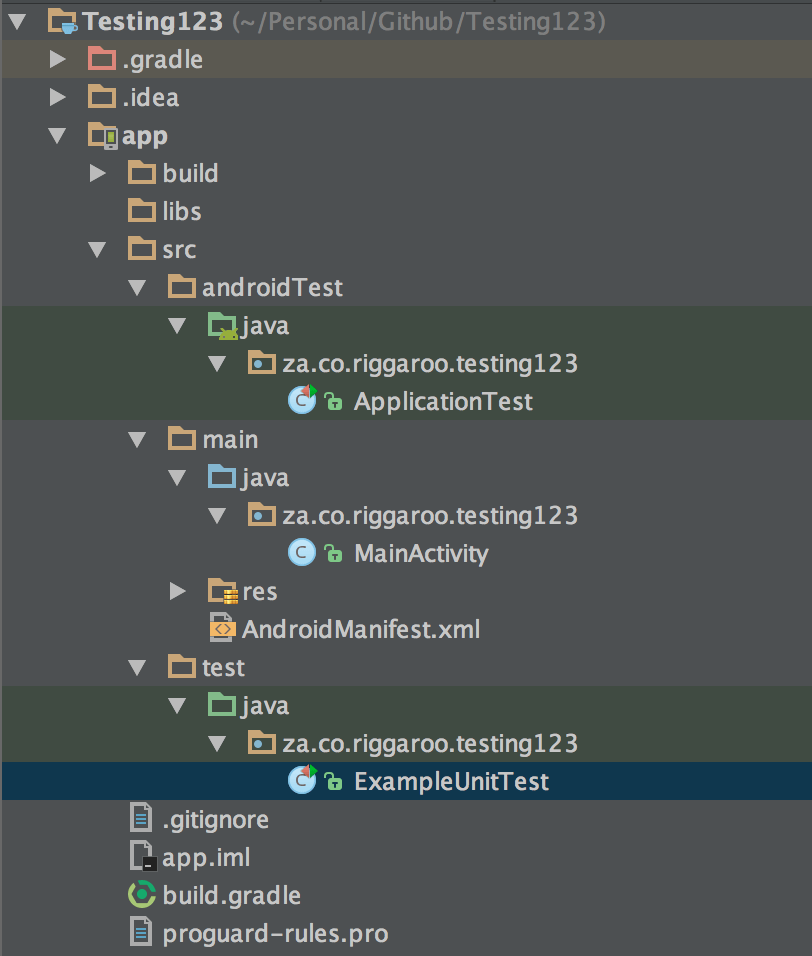

[원문](https://riggaroo.co.za/introduction-automated-android-testing/)

<!--
# Introduction to Automated Android Testing – Part 1
-->
# 안드로이드 테스트 자동화 입문하기 Part 1

<!--
I’ve seen a lot of people confused and unsure about how to do tests in Android. In the past, it was very difficult to test Android apps and there wasn’t much direction. In this series, I am going to try make testing a bit easier for you. This first post is just to get you started with testing, the next few will go more in depth into testing in Android. Let’s get started!
-->
저는 안드로이드 테스트를 어떻게 해야하는지 어려워하는 사람들을 많이 보았습니다. 예전에는 안드로이드 앱에서 테스트하는 것은 매우 어려웠고 방법이 많지도 않았습니다. 이번 안드로이드 테스트 자동화 입문하기 시리즈에서는 좀 더 쉽게 테스트할 수 있는 방법을 소개하겠습니다. 첫 번째 글은 테스트를 시작하기 위한 준비를 하고, 다음 글들에서 안드로이드 테스트에 대해 더 깊히 알아 볼 예정입니다. 시작해봅시다!

<!--
## Why should I test anyway?
-->
## 왜 테스트를 해야하나요?

<!--
You probably don’t really need convincing, since you are already reading this blog post. Here are some reasons why I like to write tests:
-->
여러분은 이미 이 글을 읽고 있으니 더 설명할 필요가 없을 것 같습니다. 제가 테스트를 작성하는 이유들은 다음과 같습니다.

<!--
- Testing forces you to think in a different way and implicitly makes your code cleaner in the process.
- You feel more confident about your code if it has tests.
- Shiny green status bars and cool reports detailing how much of your code is covered are both consequences of writing tests.
- Regression testing is made a lot easier, as automated tests would pick up the bugs first.
-->
- 테스트를 하는 것은 여러분들이 개발시에 다른 방법으로 생각할 수 있게 해주며 암묵적으로는 여러분들의 코드를 더 깔끔하게 작성할 수 있도록 해줍니다.
- 테스트를 거친 코드에 대해서는 더욱 자신감을 가지게 해줍니다.
- 빛나는 초록색 상태바와 여러분의 코드에 대한 레포트의 상세 내용들은 테스트 작성의 결과입니다.
- 자동화된 테스트가 먼저 버그를 잡아내므로 리그레션 테스트를 더 쉽게 만들어줍니다. 

<!--
Regression testing is the biggest benefit for me. If you refactor and your tests still pass, you will be confident that you haven’t broken anything. The problem with testing is that you might not see the benefit of testing immediately, as the true value will only surface a couple of months later when you need to refactor.
-->

<!--
## What types of testing are there in Android?
-->
## Android에는 어떤 유형의 테스트가 있나요?

<!--
### Unit Testing
-->
### 유닛 테스트

<!--
A unit test generally exercises the functionality of the smallest possible unit of code (which could be a method, class, or component) in a repeatable way.
-->
유닛 테스트는 일반적으로 가능한 최소 단위 코드(메소드, 클래스, 컴포넌트 등)의 기능을 반복적으로 동작시킵니다.

<!--
Tools that are used to do this testing:
-->
유닛 테스트를 위한 툴:

<!--
- JUnit – normal test assertions.
- Mockito – mocking out other classes that are not under test.
- PowerMock – mocking out static classes such as Android Environment class etc.
-->
- [JUnit](http://junit.org/) - 일반적인 테스트
- [Mockito](http://mockito.org/) - 테스트를 하지 않을 다른 클래스들을 mocking함
- [PowerMock](https://github.com/jayway/powermock) - 안드로이드 환경 클래스와 같은 정적 클래스들을 mocking함

<!--
### UI Testing – Instrumentation Tests
-->
### UI 테스트 - Instrumentation 테스트

<!--
A UI Test or Instrumentation Test mocks typical user interactions with your app. Clicking on buttons, typing in text are some of the things UI Tests can complete.
-->
UI 테스트 혹은 Instrumentation 테스트는 일반 유저들과 앱 사이의 인터랙션을 mocking합니다. 버튼을 클릭하고, 글자를 입력하는 것은 UI 테스트가 수행할 수 있는 것 중 일부입니다.

<!--
Tools that are used to do this testing:
-->
UI 테스트 혹은 Instrumentation 테스트를 위한 툴:

<!--
- Espresso –  Used for testing within your app, selecting items, making sure something is visible. 
- UIAutomator – Used for testing interaction between different apps.
-->
- [Espresso](https://google.github.io/android-testing-support-library/docs/espresso/) - 아이템을 선택하고 원하는 항목이 표시되는지 테스트하는데 사용
- [UIAutomator](https://developer.android.com/training/testing/ui-testing/uiautomator-testing.html) - 다른 앱들 간의 인터랙션을 테스트하는데 사용

<!--
There are other tools that are available for this kind of testing such as Robotium, Appium, Calabash, Robolectric. 
-->
그외에도 [Robotium](http://robotium.com/), [Appium](http://appium.io/), [Calabash](http://calaba.sh/), [Robolectric](http://robolectric.org/)과 같은 여러 유형의 테스트를 위한 툴들이 있습니다.

<!--
## What do I need to get started with Automated Testing?
-->
## 테스트 자동화를 하기위해 무엇이 필요한가요?

<!--
In order for you to get started with automated testing in your app, you should follow some kind of architectural pattern that will help you test and structure your app in a clean, testable way. One such pattern that easily enables testing is Model View Presenter (MVP) for Views and Repository Pattern for Networking and Database Access.
-->
테스트 자동화를 하기 위해서는 테스트를 도와주고 앱을 깔끔하고 테스트 가능한 구조로 만들어줄 아키텍처 패턴을 따라야합니다. 테스트를 쉽게 할 수 있도록 해주는 패턴 중 하나는 뷰를 위한 [MVP 패턴](https://en.wikipedia.org/wiki/Model%E2%80%93view%E2%80%93presenter)과 네트워크 통신과 데이터베이스 접근을 도와줄 [Repository 패턴](https://martinfowler.com/eaaCatalog/repository.html)입니다.

<!--
Of course, this is not the only option for you as an Android Developer, it is one of the many that you can explore in order to get test coverage and a clean architecture.
I have found it very difficult to implement tests without having a defined structure, often my tests were useless and I didn’t know what to test, it was also very difficult to get code coverage on large apps. My UI tests were also not very reliable as they were testing against production servers. Hopefully we can address these issues in this blog series.
-->
물론 이것은 안드로이드 개발자의 유일한 옵션은 아니며 테스트 범위와 깔끔한 아키텍처를 얻기 위한 많은 옵션 중 하나입니다.
정의된 구조없이 테스트를 수행하는 것은 매우 어렵습니다. 제 테스트는 종종 쓸모없어지거나 어떤 것을 테스트해야 하는지 알 수 없게 되었습니다. 규모가 큰 앱의 코드 범위를 얻는 것 또한 매우 어렵습니다. 저의 UI 테스트는 운영 서버를 테스트 할 때 신뢰하기 어려웠습니다. 이번 안드로이드 테스트 자동화 입문하기 글에서 이런 이슈들을 논의할 수 있기를 바랍니다.

<!--
## Structure your App in a Testable Way
-->
## 테스트 가능한 방식으로 앱 구조화

<!--
Here is a diagram depicting the structure I will use as a guideline for the rest of the blog post series:
-->
이번 글들에서 가이드라인으로 사용하려는 구조를 묘사한 다이어그램입니다.

<!--
- Views  – Activities and Fragments. This is where we set text and make UI changes. I typically like to keep the Android specific code in this section and try not to pass a context further than the view, obviously this is not always easy but it is good guidance to try follow. Views should only talk to presenters.
- Presenters – This is where business logic to decide what should be displayed on the views is going to go. Presenters talk to the repositories to get information out, and convey information to the Views. Try avoid putting Android specific code in your presenter if you can avoid it as it will make unit testing more difficult.
- Repositories – Decide where to get data from, should they come from local persisted data? Or should the data come from the network? Repositories talk to presenters.
- Models – Typically POJOs, these are models that are used by the Presenter and the View to convey information to the View from the Presenter.
-->
- Views - 액티비티와 프래그먼트. 텍스트를 배치하거나 UI를 변화가 생기는 부분입니다. 일반적으로 안드로이드 관련 코드를 이곳에 작성하려고 하고, 뷰보다 멀리 컨텍스트를 전달하지 않고자 합니다. 분명 이것은 쉽지 않지만 따르기 좋은 가이드라인입니다. 뷰는 프레젠터와만 이야기합니다.
- Presenters - 뷰에 어떤 것이 보여질 것인지 결정하는 비즈니스 로직이 위치하는 부분입니다. 프레젠터는 레파지토리에 정보를 요청하고 뷰에 전달합니다. 유닛 테스트가 더 어려워지지 않게 하기 위해 이 부분에 안드로이드 관련 코드를 넣지 마세요.
- Repositories - 데이터가 로컬에서 가져와야 하는지 네트워크에서 가져와야 하는지 결정합니다. 레파지토리는 프레젠터랑 대화합니다.
- Models - 일반적으로 POJO형태로 프레젠터로부터 뷰로 정보를 전달하기 위해 사용되는 모델입니다.

<!--
Unit tests will test the Presenters and the Repositories. UI Tests will test the View all the way down to the repositories.
-->
유닛 테스트는 프레젠터와 레파지토리를 테스트합니다. UI 테스트는 뷰로부터 레파지토리까지 이어지는 과정 전부를 테스트합니다.

<!--
There are many great articles describing MVP and other architecture options – this blog post is not going to go into those details. Read more about different Android architectures here, here and here.
-->
MVP와 다른 아키텍처 옵션에 대해 설명하는 좋은 글들이 많이 있습니다. 이 글에서는 이 것에 대해 자세히 다루지 않습니다. 다른 안드로이드 아키텍처에 대해 [여기](https://labs.ribot.co.uk/android-application-architecture-8b6e34acda65#.qbyl367c7)와 [여기](https://github.com/googlesamples/android-architecture), [여기](https://github.com/android10/Android-CleanArchitecture)에서 더 볼 수 있습니다.

<!--
## Where are Automated Tests placed in my Android app?
-->
## 자동화 테스트가 어디에 있죠?

<!--
In your Android app folder structure, there are two folders that will house the tests: `test` and `androidTest`
-->
안드로이드 앱 폴더 구조에는 테스트를 저장할 폴더가 두 개 있습니다. `test`와 `androidTest`입니다.

<!--
`androidTest` – Android Instrumentation Tests are located here. The tests in this folder need to run on an Android Emulator or physical device.

`test/` – Unit tests are placed in this folder. Unit Tests run on the JVM on your local machine and do not run on an Android device or emulator. This means they do not have access to Android classes (such as the `Context` class).
-->
`androidTest` - 안드로이드 Instrumentation 테스트는 이 폴더에 위치합니다. 이 폴더에 있는 테스트들은 안드로이드 에뮬레이터나 실제 디바이스에서 동작합니다.

`test/` - 유닛 테스트들은 이 폴더에 위치합니다. 유닛 테스트는 여러분의 로컬 머신에 있는 JVM에서 동작합니다. 안드로이드 디바이스나 에뮬레이터에서 동작하지 않습니다. 이것은 (`Context` 클래스와 같은)안드로이드 클래스에 접근하지 못함을 의미합니다.

<!--
Now that we are aware of the different kinds of tests and where to place in them in our apps. The next post we will go deeper into how to structure your code in order to allow for better unit testing. Check out Part 2 here!
-->
지금까지 여러 테스트 종류에 대해 알아보고 그것들을 어디에 저장해야 하는지 살펴보았습니다. 다음 글에서는 더 나은 유닛 테스트를 위해 어떻게 코드 구조를 구현해야하는지 더 깊게 배워봅시다.
