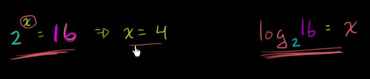
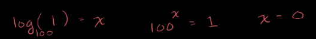

# 칸 아카데미 로그 강좌 정리

[https://ko.khanacademy.org/math/algebra2/exponential-and-logarithmic-functions/introduction-to-logarithms/v/logarithms](https://ko.khanacademy.org/math/algebra2/exponential-and-logarithmic-functions/introduction-to-logarithms/v/logarithms)

## 로그 기본 개념

- 2를 x승하면 16이 나옴
- 2를 몇 승 해야 16이 나오는데 그 몇을 x로 둠

- 어떤 수든 0승을 하면 1이 되므로 x는 0
