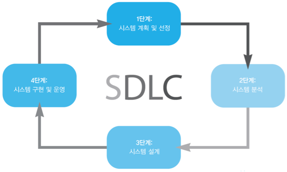
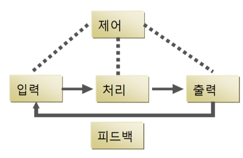

# Chapter 01. 시스템 개발 환경

## 정보시스템 분석 및 설계란 무엇인가? (information systems analysis and design)

**정의**: 기본적인 비즈니스 기능들을 수행하는 정보시스템을 구축하고 유지관리하는 방법.

**목적**: 주요 비즈니스 업무에 소프트웨어 솔루션을 적용하여 직원들의 업무 효율성을 높이는 것.

- 시스템 분석가(systems analysis)는 다음과 같은 사항들을 기반으로 분석과 설계를 수행함.
	- 조직의 목표, 구조, 프로세스에 대한 이해.
	- 이익을 위하여 어떻게 정보기술을 활용하는지에 대한 지식.
- 성과를 얻기 위해서는 구조적인 접근이 필요. (SDLC 접근 방법 등)

## 시스템 분석 및 설계: 핵심 개념들

**응용소프트웨어(application software)**: 시스템이라고도 하며, 데이터를 정보로 전환해 사용자를 지원하기 위해 설계된 소프트웨어.

**정보시스템과 관련된 요소**

- 하드웨어 및 시스템 소프트웨어
- 문서 및 교육 자료
- 시스템과 관련된 직무
- 부정 및 도난 방지를 위한 통제 소프트웨어
- 업무 수행을 위해 소프트웨어를 사용하는 사람들

**소프트웨어 엔지니어링 프로세스**

정보시스템을 구축하는 데 사용되는 프로세스.

1. 방법론(methodologies): 정보시스템 구축을 도와주는 일련의 단계들로 구성된 접근방법.
2. 기법(techniques): 시스템 분석가가 분석 및 설계를 용의주도하고, 완전하고, 포괄적으로 수행하기 위해 따르는 프로세스.
3. 도구(tools): 기법들의 적용을 도와주는 CASE 도구와 같은 컴퓨터 프로그램들.

## 시스템 (system)

### 시스템과 시스템 요소의 정의

**정의**: 공통적 목표 달성을 위해 관련된 구성요소들의 집합. 하나의 사업 단위에서 어떤 목적을 위해 함께 동작하는 비즈니스 절차의 상호 연관된 집합.

**예시**: 교통 시스템 - 구성요소: 도로, 운송체 등 / 공통 목적: 원활한 이동

**특징**

1. 구성요소(component): 더 이상 축소시킬 수 없는 하나의 시스템 구성 부분 또는 부분들이 모인 하나의 집합으로서 하위시스템(subsystem)이라고 함.
2. 상호연관(interrelated): 시스템의 한 구성요소가 한 개 이상의 다른 구성요소들에 의존하는 것.
3. 경계선(boundary): 시스템의 내부와 외부를 표시해주며 해당 조직의 다른 시스템들과 구분시켜주는 선. 시스템을 환경과 구분해줌.
4. 목적(purpose): 시스템의 전반적인 목적 또는 기능. 시스템의 존재 이유.
5. 환경(environment): 시스템과 상호작용하는 시스템 외부(경계선 밖)의 모든 것.
6. 인터페이스(interface): 시스템과 환경이 만나거나 하위시스템들이 서로 만나는 지점.
7. 제약조건(constraint): 시스템이 달성할 수 있는 것에 대한 한계.
8. 입력물: 시스템이 기능을 수행하기 위해 환경으로부터 받아들이는 것.
9. 산출물: 목적 달성을 위해 시스템이 기능의 결과를 환경으로 다시 내보내는 것.

### 시스템 관련 중요 개념들

**분해(decomposition)**

- 시스템을 보다 작은 구성요소들로 분할하는 과정.
- 분해는 시스템 분석가가 다으모가 같은 것들을 가능하게 함.
	- 시스템을 보다 작고, 보다 관리가 용이하고, 보다 이해하기 좋은 하위시스템들로 분할할 수 있음.
	- 다른 영역에 의한 간섭없이, 단번에 한 영역에 집중할 수 있음.
	- 사용자들이 불필요한 사항들로 인한 훈동 없이, 자신이 속한 그룹과 관련된 시스템 부분에만 집중할 수 있도록 해줌.
	- 시스템의 상이한 부분들을 각각의 일정에 맞춰 구축해나갈 수 있으며, 다양한 분석가들의 도움을 받을 수 있음.

**모듈화(modularity)**

- 시스템을 상대적으로 동일한 크기의 모듈들로 나누는 과정.

**결합(coupling)**

- 서로 의존관계를 가지고 있는 하위시스템들은 결합되어 있음.

**응집(cohesion)**

- 하위시스템들이 서로 의존하는 정도.

## 시스템 분석 및 설계에 대한 현대적인 접근방법

프로세스지향(process-oriented)과 데이터지향(data-oriented)가 있음.

**시스템 통합(system integration)**

- 여러 벤더들로부터 제공되는 하드웨어와 소프트웨어를 활용함.
- 절차적 언어에 기반을 둔 시스템이 비주얼 프로그래밍 시스템과 연동되도록 해줌.
- 비주얼 프로그래밍 환경은 클라이언트/서버 모델을 바탕으로 함.

### 시스템 개발에서 시스템 분석가의 역할

조직의 개선을 위해 사람, 방법, 정보기술을 어떻게 결합시킬지에 대한 결정을 하기 위해 조직의 문제점들과 니즈들을 분석함. 사용자들과 관리자들이 새로운 또는 개선된 정보시스템에 대한 요구사항들을 정의할 수 있도록 도와줌.

**시스템적 사고(systems thinking)**: 시스템을 개발하는 데 있어 가장 중요한 분석 능력 중 하나로, 조직과 정보시스템을 시스템으로 보는 관점을 갖추는 것. 사물을 시스템으로 보고, 그 요소간의 인과관계를 그래프로서 표현하고, 그 구조를 이용해서 행동의 특징파악이나 정성적인 분석을 하는 사고방식.

## 정보시스템 개발과 시스템개발생명주기

**시스템 개발 방법론(system development methodology)**: 조직이 정보시스템에 대해 분석, 설계, 구현, 유지보수를 수행할 수 있도록 안내하는 표준화된 프로세스.

**시스템개발생명주기(SDLC: System Development Life Cycle)**: 

정보시스템 개발 단계들을 관리하는 데 사용되는 일련의 단계들.

1. 계획 및 선정.
2. 분석.
3. 설계.
4. 구현 및 운영.

- 단계들이 꼭 순차적일 필요는 없음.
- 각각의 단계는 특정 결과와 산출물을 가짐.
- 모든 조직들은 생명주기 모델을 각자의 니즈에 맞게 맞춤화시켜 사용함.

### 단계 1: 시스템 계획 및 선정 (system planning and selection)

니즈 식별과 범위에 대한 조사와 결정 활동.

### 단계 2: 시스템 분석 (system analysis)

현재의 절차와 정보시스템에 대해 분석함.

- 요구사항 결정.
- 대안 생성.
- 대안 비교.
- 최적의 대안 추천.

### 단계 3: 시스템 설계 (system design)

- 논리적 설계: 시스템의 비느지스 측면에 초점을 맞춤.
- 물리적 설계: 기술적 세부내역.

### 단계 4: 시스템 구현 및 운영 (system implementation and operation)

- 구현 프로세스: 하드웨어 및 소프트웨어 설치, 프로그래밍, 사용자 교육, 문서화.
- 운영 프로세스: 환경의 변화를 반영하여 시스템 변경, 시스템 진부화.

## 시스템 개발에 대한 대안적 접근방법들

서로 다른 관점에서 시스템 분석과 설계 프로세스를 효율화하고 향상시키는 다른 방법들.

### 프로토타이핑

- 시스템을 축소된 범위이지만 가동되는 버전으로 설계하고 구축하는 것.
- 장점
	- 분석 및 설계에 사용자가 동참.
	- 요구사항을 구체적인 형태로 파악할 수 있음. 	

### CASE 도구들

- Computer-Aided Software Engineering
- 시스템 분석가들이 정보시스템 개발을 위해 사용하는 자동화된 소프트웨어 도구.
- SDLC 전반에 걸쳐 사용할 수 있음.
- 리파지토리(repository)를 통해 다양한 제품들과 도구들을 통합시킬 수 있음.
- CASE 도구의 일반적인 유형들: 다이어그래밍 도구, 컴퓨터 화면 및 리포트 생성기, 분석 도구, 중앙 리파지토리, 문서 생성기, 코드 생성기.

### 합동애플리케이션설계(JAD: Joint Application Design)

- 사용자, 관리자, 시스템 분석가들이 여러 날에 걸쳐 함께 작업하는 구조화된 회의에 참여.
- 시스템 요구사항들이 검토됨.

### 신속애플리케이션개발(RAD: Rapid Application Development)

- 사용자 요구사항이 명확해진 이후에 구체적인 시스템 설계 문서를 작성하는 것.
- 사용자 요구사항이 명확해지기 전까지는 프로토타이핑 방식을 활용함.

### 참여설계(PD: Participatory Design)

- 사용자의 역할을 강조.
- 시스템 개발 과정에서 사용자 집단 전체가 설계에 참여하게 될 수도 있음.

### 애자일 방법론들(agile methodologies)

- 적응적(adaptive) 방법론.
- 역할보다는 사람에 초점을 맞춤.
- 자기 적응적(self-adptive) 개발 프로세스.

## 강의자료 추가 내용

**시스템 접근**: 복잡한 문제를 조각으로 쪼개고, 각 조각별로 해결책을 설계하고, 그 해결책들을 온전한 시스템으로 통합하는 문제 해결 방법.

**Another View: Functional View**

- 구성요소: input, output, process(처리, 입력의 가공 활동), control(제어, 처리에 대한 지시), feedback(피드백, 재입력)
- 예시: 워드프로세서 - 입력: 문자 입력 / 출력: 시크린 상 보고서 / 처리: 편집

**BYOD (Bring Your Own Device)**: 개인의 모바일 기기를 직장에 가져와 업무에 활용하는 것.