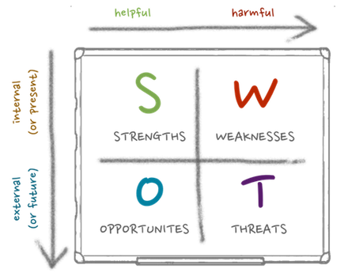

# Chapter 03. 정보시스템 프로젝트 관리

## 정보시스템 프로젝트 관리

**초점**: 정보시스템 프로젝트가 예정된 시점에서, 제약조건들과 요구사항들을 고려해 고객의 기대를 만족시킬 수 있는 결과물을 만들어 낼 수 있도록 함.

### 프로젝트

**정의**
- 하나의 목적 달성을 위해 필요한 일련의 활동들과 이를 위한 일정을 갖는 계획된 사업.
- 목표를 달성하기 위해 시작과 끝이 있는 일련의 활동들을 계획적으로 수행하는 것.

**프로젝트 현황**: 2003년 미국 IT 프로젝트 조사 보고서

- 성공한 프로젝트: 34%
- 문제가 발생한 프로젝트(품질, 지연, 비용 중 한가지 문제): 51%
- 중도 포기 프로젝트: 15%

**제약조건**

- 일정(time): 프로젝트는 계획된 기간내에 완료되어야 함. 주어진 시간을 효율적이고 생상적으로 사용해야 함.
- 자원(resource): 성공적인 프로젝트를 위하여 인적, 물적 자원의 적절한 배분 및 투입 필요.
- 범위(scope): 범위의 불명확화는 프로젝트 지연과 예산초과를 초래함. 프로젝트 개발범위의 명확화 필요.

**프로젝트 관리자**

- 시스템 분석가가 이 역할을 수행하며, 프로젝트 초기화, 계획, 실행, 종료를 책임짐.
- 관리, 리더십, 구체적 문제 해결, 갈등 관리, 고객 관계 능력이 필요함.

**산출물(deliveable)**: SDLC의 각 단계에서 생산되는 결과물.

### 프로젝트 관리 프로세스

### 1. 초기화(initiating)

1. 프로젝트 초기화 팀 구성.
2. 고객 관계 수립.
3. 프로젝트 초기화 계획 수립.
4. 관리 절차 수립.
5. 프로젝트 관리 환경과 프로젝트 작업집 마련.
6. 프로젝트 선언문 작성.
	
### 2. 계획(planning)

1. 프로젝트 범위, 대안, 실현가능성(feasibility) 설명.
 	- 프로젝트에 대한 이해.
 	- 다루어야 할 문제점이나 기회.
 	- 달성해야 할 결과들.
 	- 성공여부에 대한 측정.
 	- 완료에 대한 판단 기준.
2. 프로젝트를 관리가 용이한 작업단위들로 세분화.
 	- 작업분할구조(WBS: Work Breakdown Structure)
 	- 간트 차트(gantt chart)
3. 자원 예측 및 자원 계획 수립
4. 일정 계획(preliminary schedule) 수립.
 	- 간트 차트와 네트워크 다이어그램 활용.
5. 의사소통 계획(communication plan) 수립.
 	- 고객, 팀 멤버, 관리자 간의 의사소통 절차 설정.
 	- 리포트 유형과 배포 방식 정의.
 	- 리포트 작성 빈도 결정.
6. 프로젝트 표준 및 절차 결정.
 	- 결과물들을 생산하고 테스트하는 방식을 규정함.
7. 리스크 확인 및 평가.
 	- 리스크의 원천들을 확인함.
 	- 리스크의 결과들을 예측함.
8. 예산 편성.
9. 프로젝트 범위 기술서(project scope statement) 작성.
 	-  프로젝트 산출물들을 기술.
10. 기본 프로젝트 계획(baseline project plan) 수립.
 	- 프로젝트 작업들과 자원들을 기술.
 	
### 3. 실행(executing)

1. 기본 프로젝트 계획 실행.
	- 자원을 획득하고 할당함.
	- 새로운 팀 멤버들을 훈련시킴.
	- 프로젝트 일정을 준수함.
2. 기본 프로젝트 계획에 대한 진척사항 모니터링.
	- 자원, 예산, 활동 등을 조정함.
3. 기본 프로젝트 계획에 대한 변경 관리.
 	- 예정과 어긋난 활동 완료 시점.
 	- 실책으로 인해 다시 수행해야 하는 작업 발생.
 	- 예기치 못한 인력 변화.
 	- 새로운 활동의 필요성 발생.
4. 프로젝트 작업집 유지관리.
5. 프로젝트 상황에 대한 의사소통.
	
### 4. 종료(closeing down)

1. 종료(termination)
	- 종료의 유형(types of termination): 요구사항들이 만족된 경우의 자연스러운 종료와 프로젝트가 중단되는 경우의 부자연스러운 종료.
	- 문서화.
	- 인사평가(personnel appraisal)
2. 사후 프로젝트 검토(post_project reviews)
	- 프로젝트 산출물, 프로젝트 관리 프로세스, 개발 프로세스의 강점과 약점 평가.
3. 고객과의 계약 종결.

## 프로젝트 계획에 대한 표현과 일정수립

**간트 차트**

- 작업 기간을 시작적으로 보여줌.
- 비교적 간단한 프로젝트나 큰 프로젝트의 부분들을 보여주는데 유용함.
- 개별 작업들의 시작일과 완료일을 보여줌.
- 작업들 간의 시간 중복을 시각적으로 보여줌.
- 여유시간을 시각적으로 보여줌.

**네트워크 다이어그램**

- 활동들의 순서를 보여줌.
- 작업들 간의 의존 관계를 시각적으로 보여줌.
- 어떤 작업들이 동시에 수행될 수 있는지를 시각적으로 보여줌.
- 여유시간을 사각형 안의 데이터를 통해 보여줌.

## 강의자료 추가 내용

**프로젝트 관리에서 SMART 목표**

프로젝트 계획 수립 또는 수행시 목표 설정의 범주를 설명하는 약어로 여러 변형이 존재함.

S: specific, 구체적
M: measurable, 측정가능
A: agreeable, 합의가능
R: realistic, 현실적
T: timely, 적절시간 배정, 시간 준수

**IT 개발 프로젝트를 위한 SWOT 분석**

SWOT 분석/접근법은 조직의 강점, 약점, 기회, 단점을 중심으로 하여 IT 개발 프로젝트의 식별, 분류, 순위화 및 선택을 허락해줌.

S: strengths, 강점
W: weaknesses, 약점
O: opportunities, 기회
T: threats, 위협

