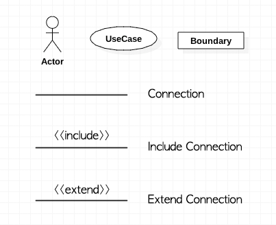

# Chapter 05. 시스템 요구사항 결정

## 요구사항 결정하기

**요구사항(requirements)**

- 시스템이 반드시 제공해야 하는 것 
- 고객이 필요로 하는 것

**요구사항의 중요성**

- 고객의 만족/불만족의 원인
- 잘못된 식별은 추후 수정 및 재작업을 야기함
- 제품 인도시 검사 기준의 핵심임

### 요구사항 결정과정

시스템 분석가들은 시스템이 수행해야 할 것들에 대해서 현 시스템의 사용자(users), 리포트(reports), 양식(forms), 절차(procedures)과 같은 많은 자료원천으로부터 정보를 모아야 함.

**요구사항 수집의 특징(characteristics for gathering requirements**

- 당돌함(impertinence): 모든 것에 의문을 가져야 함
- 공평성(impartiality): 조직 전체를 위한 최상의 해법을 찾아야 함
- 제약에 얽매이지 않음(relaxation of constraints): 모든 것이 가능하며 실행불가능을 배제해야 함
- 세심한 주의(ateention to detail): 모든 사실은 모든 다른 사실에 알맞아야 함
- 참신성(reframing): 조직을 새로운 관점으로 봐야 함

## 산출물(deliverables and outcomes)

**산출물 유형(types of deliverables)**

- 조직의 구성에 대한 이해: 사업 목표(business objective), 필요 정보(information needs), 데이터 처리 규칙(rules of data processing), 주요 이벤트(key events)
- 사용자들과 대화를 통해 수집된 정보: 인터뷰 결과서, 관찰 노트, 회의록
- 기존 문서 및 파일: 사업 목표 및 전략, 업무 양식 및 리포트 샘플, 컴퓨터 출력, 절차 매뉴얼, 직무 기술서, 교육 매뉴얼, 현 시스템의 플로우차트 및 문서, 컨설팅 보고서
- 컴퓨터기반 정보(computer-based information): 합동애플리케이션설계 모임의 결과, 현 시스템의 CASE 저장 내용 및 리포트, 시스템 프로토타입으로부터 얻어지는 산출물 및 리포트

## 요구사항 결정을 위한 전통적 방법론

- 개인들과의 인터뷰: 운영화 현 시스템의 이슈, 그리고 앞으로의 조직 활동에 따른 시스템에 대한 요구사항 등에 관해서 정보를 알고 있는 개인들과 인터뷰 수행
- 작업자의 관찰: 정해진 시간에 작업자를 관찰하여 데이터가 어떻게 다루어지고 사람들이 자신의 업무를 위해 필요로 하는 정보가 무엇인지를 파악
- 업무 문서: 조직에서 데이터와 정보의 사용에 대한 구체적인 사례뿐만 아니라 보고된 이슈, 정책, 규칙을 발견하기 위해서 업무 문서를 조사

### 인터뷰 및 탐문(interviewing and listening)

- 진술, 의견, 견해 등을 수집
- 몸짓과 감정을 관찰
- 지침(guidleines)
	- 인터뷰 일정의 수립: 인터뷰 대상자들에게 인터뷰의 목적을 설명하고 인터뷰 일정을 약속하는 준비함. 인터뷰를 위한 체크리스트, 의사일정, 질문 등을 준비함
	- 중립적인 인터뷰: 유도심문을 피하도록 함
	- 인터뷰 내용의 기록: 인터뷰를 한번에 수행하고 인터뷰 내용을 기록하거나 녹취가 허용되면 대화내용을 녹음함
	- 인터뷰 내용의 검토: 인터뷰를 수행한 후 48시간 이내에 인터뷰 일지를 검토함. 질문에 대한 보완사항이나 추가적인 정보가 필요하면 인터뷰 대상자를 다시 만나도록 함
	- 다양한 관점을 유지함: 넓은 폭의 사용자들을 대상으로 인터뷰를 수행하며 잠재적 사용자와 관리자도 포함하도록 함

**인터뷰 질문 선택하기**

- 개방형 질문(open-ended): 사전에 정의된 답변이 없음, 예기치 못한 답변을 이끌어 내는데 사용
- 폐쇄형 질문(close-ended): 응답자는 사전에 정의된 응답 중에서 답을 선택하도록 요청 받음, 질문에 대한 흔한 답변이 알려져 있을 때 매우 유용, 많은 시간이 필요하지 않기 떄문에 많은 수의 토픽들을 다룰 수 있음

### 사용자 직접 관찰하기

- 인터뷰를 보완하는 좋은 방법
- 사람들은 관찰을 당하고 있으면 대부분 평소와 다르게 작업을 하므로, 편견이 없는 데이터를 얻기가 어려움

### 절차와 기타 문서의 문석

**문서를 통해 찾을 수 있는 정보의 유형**

- 기존 시스템의 문제
- 새로운 요구를 충족할 수 있는 기회
- 조직의 방향
- 핵심 사용자의 직책과 이름
- 조직의 가치
- 특정 사건을 처리하는 특별한 정보
- 데이터 처리에 대한 규칙

## 시스템 요구사항 결정을 위한 최신 방법론

**합동어플리케이션설계(JAD, Joint Application Design)**

- 주 사용자, 관리자, 시스템 분석가를 모이게 하는 방법
- 목적: 시스템과 관련된 주요 사람들로부터 시스템 요구사항을 동시에 수집하기 위한 것
- 일반 근무 장소가 아닌 다른 장소에서 수행됨
- 참여자: JAD 회의 리더, 사용자, 관리자, 후원자, 시스템 분석가, 서기, 정보시스템 스텝
- 최정 결과: 기존 시스템과 제안된 시스템의 특성에 대한 자세한 문서

**프로토타이핑**
- 반복적 과정
- 시스템의 초보적 버전을 개발함
- SDLC를 대체하거나 강화함
- 목적: 최종 시스템에 대한 구체적인 세부내역을 개발함
- 사용자는 요구사항을 작동하는 시스템으로 빠르게 전환할 수 있음
- 사용자는 시스템으로 전환된 요구사항을 보고 나서, 수정을 요청하거나 추가 요청을 할 수 있음
- 유용한 상황
	- 사용자 요구사항이 불명확한 경우
	- 소수의 사용자가 시스템에 관련되어 있는 경우
	- 설계가 복잡하고 구체적인 폼을 필요로 하는 경우
	- 분석가와 사용자와의 의사소통 문제가 과거에도 발생한 경우
	- 프로토타입 개발을 위한 도구들이 사용 가능하도록 준비된 경우
- 결점
	- 공식적인 문서를 작성하지 않는 경향
	- 일반적인 사용자에게 적용되기가 어려움
	- 다른 시스템과의 공유가 종종 고려되지 않음
	- SDLC에서의 체크를 종종 건너뜀

## 시스템 요구사항 결정을 위한 급진적 방법론

**비즈니스프로세스재설계(BPR, Business Process Reenginerring)**

- 제품과 서비스에 있어 강력한 개선을 이루기 위한 비즈니스 프로세스의 검색, 구현, 그리고 급진적 변경 활동
- 조직의 주요 부문에서의 데이터의 모든 흐름을 재구성함
- 불필요한 절차를 없앰
- 절차를 결합함
- 미래의 변환에 더 민감해짐

### 재설계를 위한 프로세스 규명

**핵심 비즈니스 프로세스**

- 특정 고객 또는 시장에 대한 구체적인 결과물을 생산할 수 있도록 설계된 구조화되고 측정 가능한 활동들의 집합
- 고객과 결과에 집중함
- 요구사항 결정에 사용되었던 동일한 기법들이 사용됨

**파괴적 기술**

급격한 비즈니스 변화로부터 조직을 억제하면서 오랫동안 유지되어 온 비즈니스 규칙들이 붕괴도도록 만드는 기술

## 강의자료 추가 내용 - 요구사항

**요구사항**

- 시스템의 목적달성을 위해 시스템이 해야 하는 것에 관한 기술
- 사용자의 니즈

**목표**

- 사용자 니즈(needs) 식별
- 필요한 것(what)을 식별

**종류**

- 기능적 요구사항(functional requirement): 소프트웨어 프로덕트가 수행해야만 하는 액션을 명세, 입력과 출력들로 자주 표현됨
- 비기능적 요구사항(non-function requirement): 제약사항(constraint)라고도 함, 플랫폼 제약/응답 시간/신뢰성/비용과 같은 소프트웨어 프로덕트의 성질들을 명세

**FURPS**

- 요구사항의 분류를 나타내는 약어
- 소프트웨어 품질 특성을 나타내는 약어
- F: Functional requirements - 기능적
- U: Usability requirements - 사용성 (인적요소, 도움말, 문서, UI, 일관성)
- R: Reliability requirements - 신뢰성
- P: Performance requirements - 성능
- S: Supportability requirements - 지원성 (유지보수, 국제화, 지역화, 호환, 테스트)

**범위 크리프(scope creep)**

- 요구사항 크리프, 피처 크리프라고도 부름
- 프로젝트 시작 후 어떤 지점에서 프로젝트의 범위가 통제되지 않은 성장을 언급함

**표현**

- 유스케이스 다이어그램: 액터, 유스케이스
- 시나리오: 유스케이스를 서술한 것, 메인 흐름, 예외는 대안

**UML 유스케이스 다이어그램 심볼**

